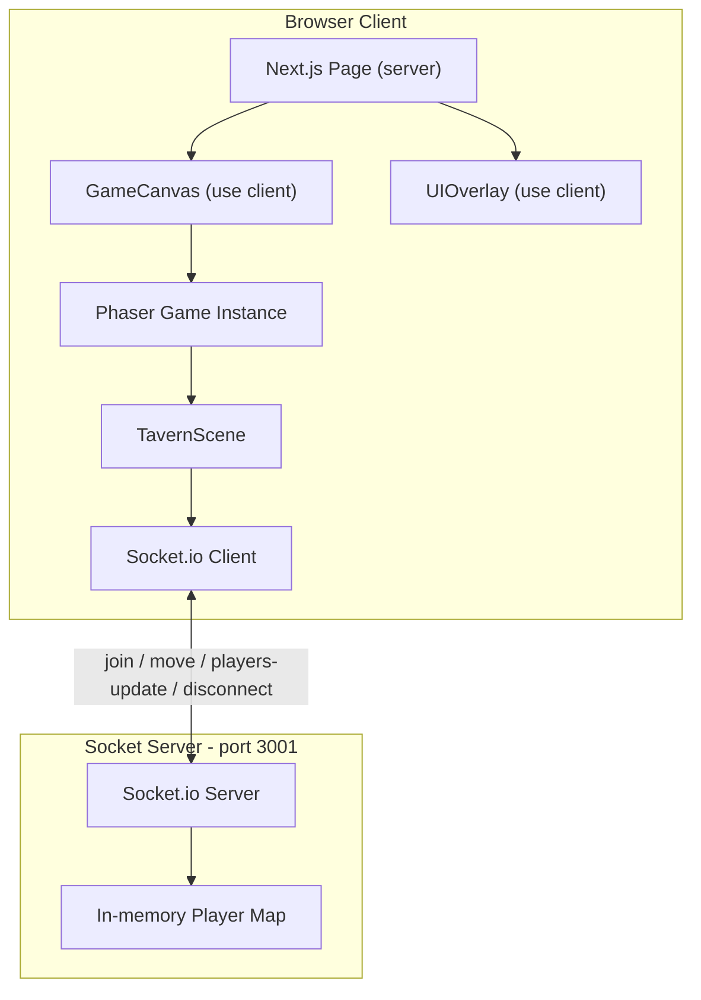

# GuildMeet MVP -- Phase 1 Plan

## Architecture Overview




The Next.js app (port 3000) serves the frontend. A **separate** standalone Socket.io server (port 3001) handles multiplayer state. This separation is intentional -- Next.js 16 defaults to Turbopack which doesn't support custom servers, and decoupling keeps things clean.

---

## Project Structure

```
guild-meet/
├── src/
│   ├── app/
│   │   ├── layout.tsx              # Root layout (tavern metadata + fonts)
│   │   ├── globals.css             # Tailwind v4 + tavern theme tokens
│   │   └── page.tsx                # Main page: GameCanvas + UIOverlay
│   ├── components/
│   │   ├── GameCanvas.tsx          # 'use client' -- mounts Phaser via ref
│   │   └── UIOverlay.tsx           # 'use client' -- bottom toolbar
│   ├── game/
│   │   ├── config.ts               # Phaser.Types.Core.GameConfig
│   │   ├── TavernScene.ts          # Main Phaser scene (room + movement + sync)
│   │   └── Player.ts               # Player rendering class (avatar + name label)
│   └── lib/
│       └── socket.ts               # Socket.io client singleton
├── server/
│   └── index.ts                    # Standalone Socket.io server
├── public/                         # (no external assets needed for MVP)
├── package.json
└── tsconfig.server.json            # TS config for server/ directory
```

---

## 1. Dependencies

Install via pnpm:

- **Runtime**: `phaser`, `socket.io-client`, `socket.io`
- **Dev**: `tsx` (to run the TS socket server), `concurrently` (to run both servers with one command)

Add a combined dev script to [package.json](package.json):

```json
"scripts": {
  "dev": "concurrently \"next dev\" \"tsx --watch server/index.ts\"",
  "dev:next": "next dev",
  "dev:server": "tsx --watch server/index.ts"
}
```

---

## 2. Socket.io Server (`server/index.ts`)

A standalone Node process on **port 3001** with CORS allowing `localhost:3000`.

**State**: `Map<string, PlayerData>` keyed by socket ID.

**Events**:

- `join` -- client sends `{ name }`, server assigns ID + random spawn position, stores player, broadcasts full player list via `players-update`
- `move` -- client sends `{ x, y }`, server updates stored position, broadcasts `players-update`
- `disconnect` -- server deletes player, broadcasts `players-update`

Needs a separate `tsconfig.server.json` targeting `ESNext` / `NodeNext` modules.

---

## 3. Socket Client Singleton (`src/lib/socket.ts`)

Lazy-initialized `io("http://localhost:3001")` connection. Exported as a getter so Phaser scene and React components can share one connection. Avoids multiple connections on HMR by checking `globalThis`.

---

## 4. Phaser Integration

### Game Config (`src/game/config.ts`)

- Type: `Phaser.AUTO`
- Parent: DOM element ref from `GameCanvas`
- Physics: Arcade (for collision)
- Scene: `TavernScene`
- Scale mode: `RESIZE` (fills viewport)
- Background: warm brown `#3b2a1a`
- Transparent: false
- Pixel art: false

### GameCanvas Component (`src/components/GameCanvas.tsx`)

`'use client'` component that:

- Uses `useRef` for the container div and Phaser game instance
- Dynamically imports Phaser in `useEffect` (avoids SSR crash -- Phaser accesses `window`)
- Creates game on mount, destroys on unmount
- Never re-renders (empty deps array, no state)

### Tavern Scene (`src/game/TavernScene.ts`)

**Room layout** (all drawn with Phaser Graphics -- no external assets needed):

```
+--------------------------------------------------+
|  WALL                                       WALL  |
|  |||                                              |
|  |B|  o      [Table1]        [Table2]             |
|  |A|  o                                           |
|  |R|  o              [Table5]                     |
|  | |  o           (center table)                  |
|  |B|  o                                           |
|  |A|  o      [Table3]        [Table4]             |
|  |R|  o                                           |
|  |||                                              |
|  [Bartender]                                      |
+--------------------------------------------------+
```

- **Floor**: Large filled rectangle, warm wood color `#5c3a1e` with subtle darker planks
- **Walls**: Darker rectangles around perimeter, used as Arcade physics static bodies for collision
- **Bar**: Tall vertical rectangle along the **left wall**, static physics body, dark wood `#3a1f0d`
- **Bartender**: Small distinct circle/sprite behind the bar (left side, tucked between bar and wall)
- **Bar stools**: Column of small circles (`o`) along the right edge of the bar, facing inward
- **Tables**: 5 round tables (~60px radius), dark wood color `#4a2c17`, static physics bodies
  - Table 1 + 2: upper row, center-right area
  - Table 3 + 4: lower row, center-right area
  - **Table 5**: prominent center table in the middle of the room (the main gathering table)
- **Chairs**: Smaller circles (~12px) positioned around each table, decorative only

**Player spawning**: Random position in the center open area, avoiding table collision zones.

**Movement** (`update` loop):

- Read WASD / Arrow keys via `this.input.keyboard.createCursorKeys()` + custom WASD keys
- Set velocity on player's physics body (speed ~200)
- Emit `move` event via socket at a throttled rate (~15 updates/sec) to avoid flooding

**Multiplayer rendering**:

- On `players-update`, iterate the list:
  - Current player: skip (we control locally with prediction)
  - Other players: create or update their sprite position with interpolation (lerp)
  - Remove sprites for players no longer in the list

### Player Class (`src/game/Player.ts`)

A helper that manages:

- A `Phaser.GameObjects.Arc` (circle) as the avatar body
- A `Phaser.GameObjects.Text` for the name label, positioned above
- Color: current player gets a distinct highlight (gold `#f0c040`), others get a muted color (`#a07050`)
- Methods: `setPosition(x, y)`, `destroy()`

---

## 5. UI Overlay (`src/components/UIOverlay.tsx`)

`'use client'` component rendered **above** the Phaser canvas via absolute positioning and `z-10`.

**Layout**: Centered bottom bar with flex row of icon buttons.

**Buttons** (all placeholders for Phase 1):

- Mic (microphone icon)
- Settings (gear icon)
- Chat (message icon)
- Leave (red, door icon) -- on click, disconnects socket and could redirect

**Styling** (Tailwind v4 classes):

- `fixed bottom-6 left-1/2 -translate-x-1/2`
- `bg-black/40 backdrop-blur-md rounded-2xl px-6 py-3`
- `flex gap-4 items-center`
- Buttons: `w-10 h-10 rounded-full` with hover states
- Leave button: `bg-red-600 hover:bg-red-700`
- Icons: inline SVG or simple Unicode symbols (no icon library needed for MVP)

---

## 6. Page Integration (`src/app/page.tsx`)

The root page becomes a simple composition:

```tsx
import GameCanvas from "@/components/GameCanvas";
import UIOverlay from "@/components/UIOverlay";

export default function Home() {
  return (
    <main className="relative w-screen h-screen overflow-hidden">
      <GameCanvas />
      <UIOverlay />
    </main>
  );
}
```

---

## 7. Root Layout + Styling (`src/app/layout.tsx`, `globals.css`)

- Update metadata: title "GuildMeet", description "Virtual tavern workspace"
- Body: `overflow-hidden`, `m-0`, `p-0` to prevent scrollbars
- Add tavern-themed CSS custom properties to `globals.css` `@theme` block (warm browns, golds)

---

## 8. Performance Considerations

- Phaser instance stored in `useRef`, never triggers React re-renders
- Socket position emissions throttled to ~15/sec (66ms interval)
- Other player positions lerped (not snapped) for visual smoothness
- `GameCanvas` uses `React.memo` or empty deps to prevent re-mounting
- No React state for game data -- all managed inside Phaser scene

---

## Key Decisions

- **Separate socket server** (not integrated into Next.js) because Next.js 16 Turbopack doesn't support custom servers. Two processes via `concurrently`.
- **No external sprite assets** for MVP -- all tavern elements drawn with Phaser Graphics API. This avoids asset loading complexity and keeps the MVP lean.
- **Arcade physics** for simple AABB collision with walls/tables. No need for Matter.js complexity.
- **Client-side prediction** for the local player (immediate movement response), with server as source of truth for other players.

